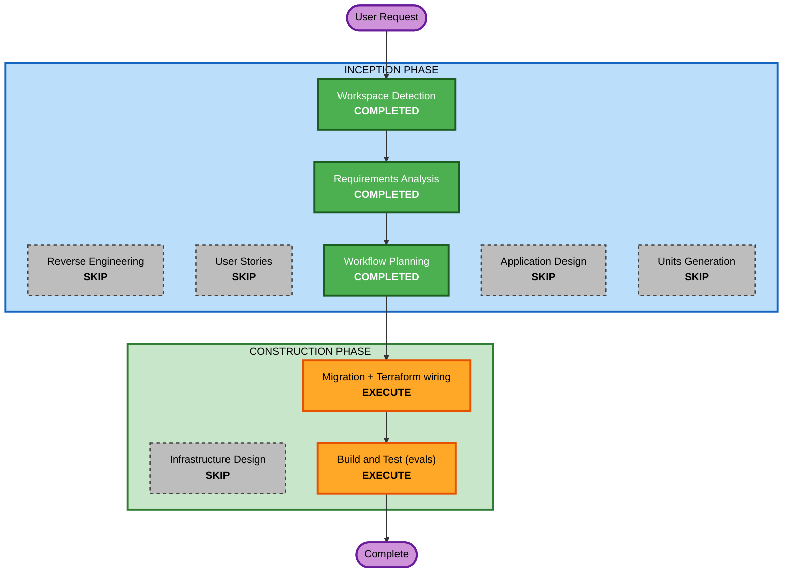

# Execution Plan — Supabase DB Migration

## Detailed Analysis Summary

### Transformation Scope (Brownfield)
- **Transformation Type**: Infrastructure / data migration (no application logic change)
- **Primary Changes**: Move local dev Postgres (`uq_courses` :5433) to the managed
  Supabase project; wire its session-pooler connection string into Terraform.
- **Related Components**: `infra/terraform/terraform.tfvars` (value only),
  `infra/terraform/rds.tf` (already an empty stub), eval harnesses (run, not change).

### Change Impact Assessment
- **User-facing changes**: No
- **Structural changes**: No (schema is copied verbatim)
- **Data model changes**: No (same 5 tables, same vector columns / HNSW indexes)
- **API changes**: No
- **NFR impact**: Yes — security (DB credential handling) and operational
  (cloud DB now the source of truth for the deployed Runtime)

### Component Relationships
- **Primary**: Supabase Postgres (new managed store)
- **Infrastructure**: Terraform `agentcore.tf` consumes `var.database_url`
- **Dependent**: backend (`app/core/config.py` DSN), eval harnesses
- **Supporting**: none changed

### Risk Assessment
- **Risk Level**: Low–Medium. Source DB untouched (read-only dump); target is
  empty (verified); all PG17 (dump/restore compatible); fully repeatable.
- **Rollback Complexity**: Easy. Failure modes leave the local DB intact; a bad
  restore is fixed by truncating/dropping on Supabase and re-running.
- **Testing Complexity**: Moderate. Count verification is deterministic; eval
  harnesses depend on external embedding + LLM providers.

## Workflow Visualization

## Phases to Execute / Skip

### INCEPTION
- [x] Workspace Detection — COMPLETED
- [x] Reverse Engineering — SKIP (no logic change; system already documented)
- [x] Requirements Analysis — COMPLETED (minimal depth)
- [x] User Stories — SKIP (no user-facing feature)
- [x] Workflow Planning — COMPLETED (this document)
- [x] Application Design — SKIP (no new components)
- [x] Units Generation — SKIP (single unit)

### CONSTRUCTION
- [ ] Infrastructure Design — SKIP (infra already authored; only a variable value set)
- [ ] Migration + Terraform wiring — EXECUTE
- [ ] Build and Test (eval harnesses) — EXECUTE

## Execution Steps (ordered)
1. **Enable pgvector on Supabase** — `create extension if not exists vector;`
   (idempotent; vector 0.8.0 available). [needs: nothing]
2. **Dump local DB** — `pg_dump "<local DSN>" -Fc --no-owner --no-privileges -f uq_courses.dump`
   (carries vectors + HNSW index defs; no re-embed). [needs: nothing]
3. **Restore into Supabase** — `pg_restore --no-owner --no-privileges -d "<SUPA>" uq_courses.dump`,
   capturing ALL stderr (extension-already-exists noise is expected; real errors surfaced). [needs: connection string]
4. **Verify counts (red line)** — on Supabase: `courses` 3050 total / 3050 embedded;
   `kb_chunks` 2521. Numbers must agree exactly, else stop and report. [needs: connection string]
5. **Wire Terraform** — write the session-pooler string into the gitignored
   `infra/terraform/terraform.tfvars` as `database_url`. [needs: connection string]
6. **Build and Test** — run `route_eval`, `answer_eval`, `kb_eval` with
   `DATABASE_URL=<SUPA>`; report pass/fail and any distribution drift. [needs: connection string + providers up]

## Open Item
- `rds.tf` (Q4=B): already a no-resource comment stub with no external references.
  "Emptying" is effectively done. The only remaining action is the user deleting
  the file in the IDE if they want it gone (the AI cannot `rm`). No edit planned
  unless the user wants the file blanked to 0 bytes.

## Success Criteria
- **Primary Goal**: Supabase serves the same data as the local dev DB, byte-for-byte
  on row counts and embeddings, reachable over the session pooler with TLS.
- **Key Deliverables**: migrated Supabase DB; `database_url` set in tfvars; eval
  results recorded.
- **Quality Gates**: counts match exactly (FR3); eval harnesses pass (FR5 / student-facing red line 6); no secret committed (NFR1 / SECURITY-12).

## Security Compliance (Security Baseline enabled)
- **SECURITY-01** (encryption in transit): COMPLIANT-by-design — Supabase pooler
  enforces TLS; `database_url` uses the TLS endpoint. Encryption at rest is
  Supabase-managed.
- **SECURITY-12** (no hardcoded credentials): ENFORCED — the connection string
  (with password) goes ONLY into gitignored `terraform.tfvars` or an env var;
  never into tracked files, logs, or aidlc-docs.
- **SECURITY-03** (no secrets in logs): ENFORCED — restore/eval output will not
  echo the password; commands reference the string via a shell variable, and
  any printed connection string is masked.
- **SECURITY-15** (fail closed / surface errors): ENFORCED — pg_restore stderr is
  captured and reported; count mismatch halts the flow (no silent success).
- **SECURITY-02, 04, 05, 06, 07, 08, 09, 10, 11, 13, 14**: N/A for this task —
  no new network intermediaries, web endpoints, API handlers, IAM policies,
  app code, dependencies, or deserialization are introduced. (These apply to the
  Terraform stack as a whole, already authored, and are out of scope for this
  data-migration unit.)
